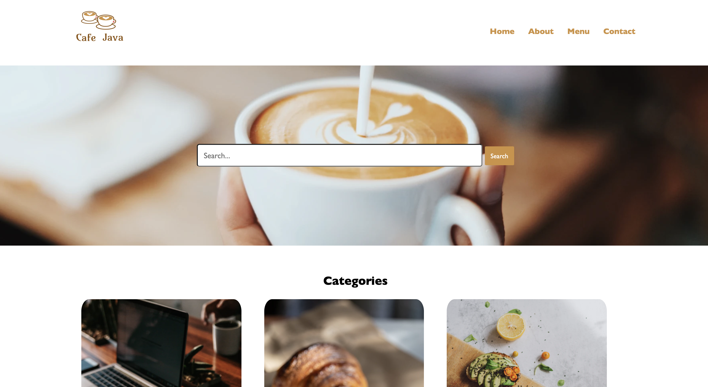
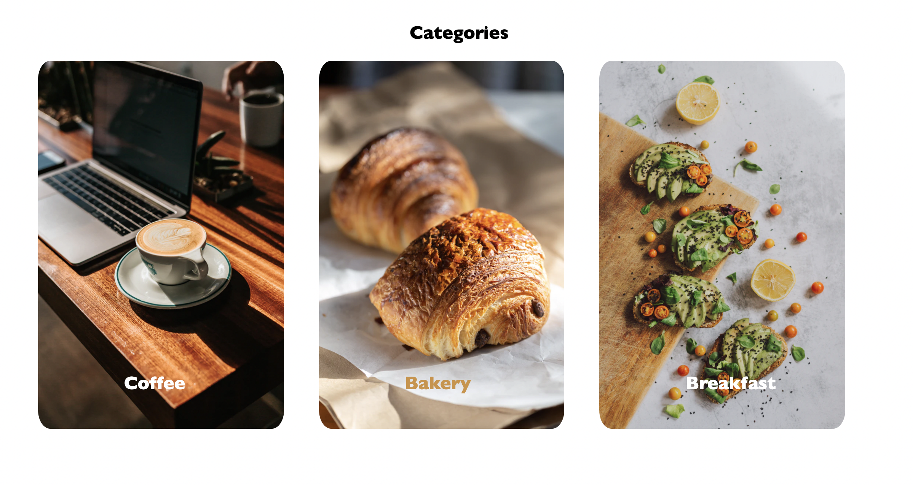
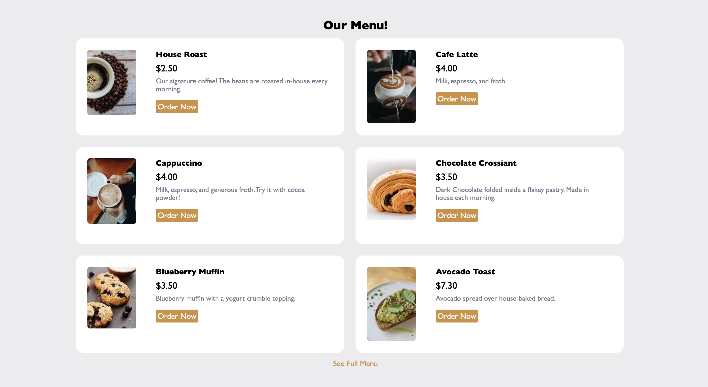

# Cafe Java

## Description

_Currently Being Built_

The local coffee shop for techies is getting a new web application! Stay tuned for more information!

## Screen Shot
The homepage of the application, including a search bar to quickly find the menu item you are craving.

Space where user's can quickly sort through the menu options by category.

Our menu, stylishly displayed!

## Built With

This appliciaton was made with these technologies:
- PHP
- mySQL
- HTML
- CSS

## Acknowledgement
Isaac - thank you for being you. Words cannot express how thankful I am that you were willing to take the large brunt of parenting our tiny hoomans while I furthered my career.

## Support
If you have suggestions or issues, please email me at [mary.mettille.brist@gmail.com]
